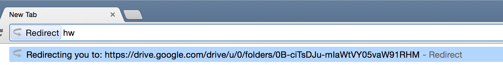

# redirect

> A Chrome extension that allows users to easily navigate to saved urls.

## Overview 
[Redirect](
https://chrome.google.com/webstore/detail/redirect/ndmlefihodnjkipamdighnjjmiddafai) is a Chrome extension that makes it easy to navigate to custom urls. Users can save short keys that map to saved urls. Typing ";" and then the saved key into the address bar opens the users saved url. It is intended to make navigating to urls fast and easy.

[Download it](
https://chrome.google.com/webstore/detail/redirect/ndmlefihodnjkipamdighnjjmiddafai) it from the Chrome Web Store.

    

    

## Feedback 
I use Redirect everyday and love it. If you requests for features or any feedback to share, feel free to contact me. 
